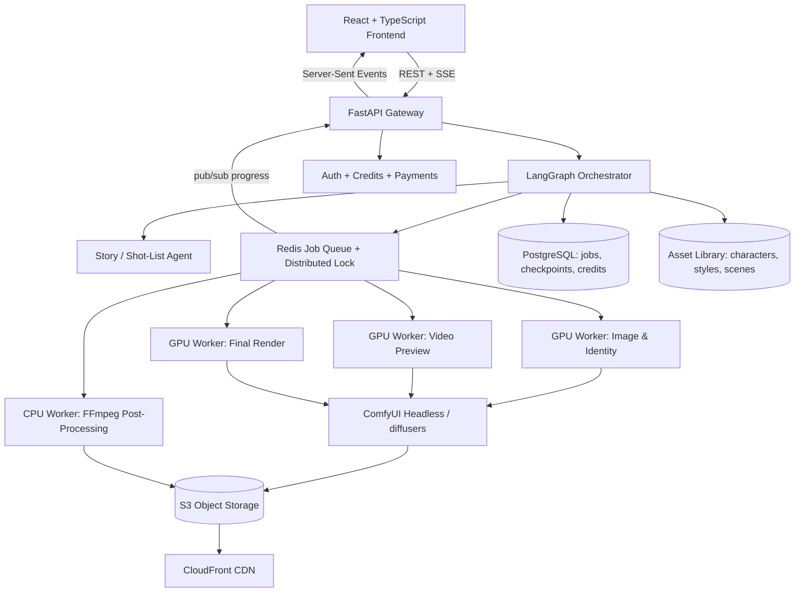

# MotionFrame AI

**Turn a photo and a story into a cinematic, motion-realistic short video — and see a cheap preview before you spend a single credit.**

MotionFrame AI is a motion-focused AI video generation platform built entirely on open models. It is designed to be cost-efficient, preview-first, and built for short-form creators, with a special focus on India.

> **Status: Early development.** Architecture, model evaluation, and the first proof of concept are in progress. Follow the [Roadmap](#roadmap) to see what is being built.

---

## Table of Contents

- [Motivation](#motivation)
- [The Problem](#the-problem)
- [The Solution](#the-solution)
- [Core Features](#core-features)
- [How It Works](#how-it-works)
- [Architecture](#architecture)
- [Open-Source Model Catalog](#open-source-model-catalog)
- [Tech Stack](#tech-stack)
- [Planned Repository Structure](#planned-repository-structure)
- [Cost Strategy](#cost-strategy)
- [Roadmap](#roadmap)
- [Responsible AI](#responsible-ai)
- [Contributing](#contributing)
- [Author](#author)

---

## Motivation

This project is my step from **Applied AI engineering** into **AI Media Engineering** — the space where generative models, video pipelines, GPU infrastructure, and product design meet.

I have built production AI pipelines that compose classification, object detection, and vision-LLM models into orchestrated graphs. Generative video is the next frontier for that same engineering discipline: the models exist, but turning them into a **reliable, affordable, controllable product** is still an unsolved engineering problem.

While creating AI shorts myself using commercial platforms, I repeatedly ran into the same frustration: **paying credits for outputs I could not use**, with no way to know what the model would generate before committing. MotionFrame AI is my attempt to fix that — built in public, with open models.

---

## The Problem

Current AI video platforms share a few common issues:

1. **Pay first, hope later.** Users spend credits on a full generation without any preview of what the model will produce.
2. **Bad physics.** Prompt-only generation struggles with realistic motion — impacts, falls, thrown objects, and body movement often look wrong.
3. **Little control.** Users cannot direct the exact movement they have in mind.
4. **Expensive for emerging markets.** Pricing is built for USD markets, not for Indian creators and small businesses.
5. **Failed generations still cost money.** Errors and broken outputs are rarely refunded automatically.

---

## The Solution

MotionFrame AI is built around three principles:

### 1. Preview-first generation
Every video goes through a cheap storyboard and low-resolution motion preview. Users only spend full credits on a video they have already seen and approved.

### 2. Act-to-Cinema (motion reference)
Instead of relying on prompts to describe physics, users can **record themselves acting out the motion** on a phone. The system transfers that real human movement into the cinematic scene — with their face, their chosen location, and their props.

### 3. Motion-focused and cost-efficient
The platform does one thing well: realistic, motion-driven short videos for reels and shorts. Every architectural decision is measured against **cost per usable clip**.

---

## Core Features

| Feature | Description | Status |
|---|---|---|
| Story → Shot List | An LLM breaks a user's story into shots with camera, action, and timing | Planned |
| Identity-Consistent Keyframes | Generates scene frames that keep the user's face consistent | Planned |
| Storyboard Preview | Near-free keyframe storyboard for approval | Planned |
| Low-Res Motion Preview | Fast, cheap draft video before the final render | Planned |
| Act-to-Cinema | Motion transfer from a user's reference video | Planned |
| First-Last-Frame Control | Define start and end poses; the model fills the motion | Planned |
| Camera Motion Presets | Dolly, orbit, crash zoom, handheld, and more | Planned |
| Sound Effects & Voiceover | SFX from video plus Indian-language TTS | Planned |
| Auto-Stitch & Export | Multi-shot stitching with 9:16 reel export | Planned |
| Auto-Refund on Failure | Failed generations automatically return credits | Planned |

---

## How It Works

```
User photo(s) + story (+ optional acting video)
        │
        ▼
1. Story Agent      → LLM converts story into a structured shot list
        │
        ▼
2. Keyframe Stage   → Image models generate identity-consistent start/end frames
        │
        ▼
3. Storyboard Approval (cheap — user reviews and edits)
        │
        ▼
4. Preview Render   → Low-res, few-step, short draft video per shot
        │
        ▼
5. Preview Approval (user confirms motion before spending full credits)
        │
        ▼
6. Final Render     → Full-quality generation reusing the approved seed and frames
        │
        ▼
7. Post-Processing  → Upscale, frame interpolation, SFX, voiceover, stitching
        │
        ▼
Final 9:16 video, ready for Reels / Shorts
```

---

## Architecture



### Key architectural decisions

- **Orchestration:** A stateful LangGraph pipeline with PostgreSQL checkpoints enables pause/resume at every human approval step.
- **Queueing:** GPU jobs run through a Redis-backed queue with distributed locks, since video generation takes minutes, not milliseconds.
- **Model tiering:** Cheap, fast models for previews; heavy models only for approved final renders.
- **Live progress:** Redis pub/sub streams progress to the UI over Server-Sent Events.
- **Failure isolation:** A failed shot does not fail the whole video; it is retried or refunded independently.
- **Serving:** ComfyUI runs headless as an internal inference API, so new open models can be adopted quickly.

---

## Open-Source Model Catalog

This is the working list of open models being evaluated for each stage of the pipeline.

>  **License note:** Licenses change and some weights have non-commercial or regional restrictions even when the code is open. **Always verify the license on the official model page before any commercial use.** The notes below are a starting point, not legal advice.

### Video Generation (core)

| Model | Developer | Use in MotionFrame AI | License note |
|---|---|---|---|
| **Wan 2.2 I2V-A14B** | Alibaba (Wan-AI) | Main image-to-video engine | Apache 2.0 |
| **Wan 2.2 T2V-A14B** | Alibaba (Wan-AI) | Text-to-video for B-roll and backgrounds | Apache 2.0 |
| **Wan 2.2 TI2V-5B** | Alibaba (Wan-AI) | Lightweight, fast model for previews | Apache 2.0 |
| **Wan 2.2 Animate-14B** | Alibaba (Wan-AI) | Act-to-Cinema motion transfer and character replacement | Apache 2.0 |
| **Wan 2.2 S2V-14B** | Alibaba (Wan-AI) | Speech/audio-driven character video | Apache 2.0 |
| **Wan 2.1 FLF2V-14B** | Alibaba (Wan-AI) | First-last-frame controlled motion | Apache 2.0 |
| **Wan 2.1 VACE** (1.3B / 14B) | Alibaba (Wan-AI) | All-in-one control: pose, depth, masks, references | Apache 2.0 |
| **LTX-2 / LTX-2.3** | Lightricks | Fast generation with native audio; camera-control LoRAs | Custom open-weights license — verify |
| **HunyuanVideo / HunyuanVideo-I2V** | Tencent | Quality benchmark and alternative I2V | Tencent community license, has regional restrictions — verify |
| **CogVideoX** (2B / 5B) | Zhipu AI / THUDM | Lightweight alternative and research baseline | Varies by size — verify |
| **Mochi 1** | Genmo | Alternative text-to-video baseline | Apache 2.0 |
| **SkyReels V2** | Skywork | Long-form and cinematic generation experiments | Verify |
| **Open-Sora 2.0** | HPC-AI Tech | Research baseline, fully open training code | Apache 2.0 |

### Video Acceleration

| Tool | Purpose |
|---|---|
| **LightX2V** step-distillation LoRAs | Cut Wan inference from dozens of steps to a handful |
| **TeaCache / MagCache** | Skip redundant diffusion steps via caching |
| **SageAttention** | Faster attention kernels |
| **FP8 / GGUF quantization** | Lower VRAM use and cheaper GPUs |
| **xDiT** | Multi-GPU parallel inference for diffusion transformers |
| **torch.compile** | Graph-level speed-ups |

### Image Generation & Editing (keyframes)

| Model | Developer | Use | License note |
|---|---|---|---|
| **Qwen-Image** | Alibaba (Qwen) | Scene and keyframe generation, strong text rendering | Apache 2.0 |
| **Qwen-Image-Edit** | Alibaba (Qwen) | Edit the user's photo into new poses and scenes | Apache 2.0 |
| **FLUX.1 Kontext [dev]** | Black Forest Labs | High-quality context-aware image editing | Non-commercial dev license — verify |
| **FLUX.1 [schnell]** | Black Forest Labs | Very fast image generation for storyboards | Apache 2.0 |
| **HiDream-I1** | HiDream.ai | Alternative high-quality image generation | Verify |
| **SDXL** | Stability AI | Mature ecosystem of LoRAs and ControlNets | OpenRAIL++ — verify |

### Identity & Face Consistency

| Model | Use | License note |
|---|---|---|
| **PuLID** | Keep the user's face consistent across generations | Verify code and weights |
| **InstantID** | Identity-preserving image generation | Code open; depends on InsightFace models with non-commercial terms — verify |
| **IP-Adapter** | Image-prompt conditioning for style and identity | Apache 2.0 |
| **InsightFace** | Face detection, alignment, embeddings | Pretrained models are non-commercial — verify |

### Motion & Scene Control

| Model | Use | License note |
|---|---|---|
| **DWPose** | Extract body skeletons from the user's acting video | Apache 2.0 — verify |
| **OpenPose** | Alternative pose estimation | Non-commercial academic license — verify |
| **Depth Anything V2** | Depth maps for scene structure and camera moves | Small model Apache 2.0; larger models non-commercial — verify |
| **Video Depth Anything** | Temporally consistent depth for video | Verify |
| **SAM 2** | Segment and track objects (people, props, cars) across frames | Apache 2.0 |
| **CameraCtrl / MotionCtrl** | Research approaches for explicit camera trajectory control | Verify |

### Post-Processing

| Model | Use | License note |
|---|---|---|
| **RIFE** | Frame interpolation for smoother motion | MIT |
| **Real-ESRGAN** | Upscaling previews to final resolution | BSD-3-Clause |
| **SeedVR2** | Video restoration and upscaling | Verify |
| **CodeFormer / GFPGAN** | Face restoration | CodeFormer is non-commercial; GFPGAN Apache 2.0 — verify |

### Audio

| Model | Use | License note |
|---|---|---|
| **MMAudio** | Generate sound effects synced to video | Code MIT; weights non-commercial — verify |
| **HunyuanVideo-Foley** | Video-to-foley sound generation | Verify |
| **Stable Audio Open** | Background music and ambience | Stability community license — verify |
| **Indic Parler-TTS** (AI4Bharat) | Hindi, Marathi, and other Indian-language voiceovers | Apache 2.0 |
| **IndicF5** (AI4Bharat) | Natural Indian-language TTS | Verify |
| **Whisper** | Speech-to-text for auto-subtitles | MIT |
| **IndicTrans2** (AI4Bharat) | Translation across Indian languages | MIT |

### Language Models (story and shot planning)

| Model | Use | License note |
|---|---|---|
| **Qwen3** | Self-hosted story-to-shot-list agent | Apache 2.0 |
| **Llama 3.x** | Alternative self-hosted planner | Llama community license |
| **Claude / others via AWS Bedrock** | Hosted fallback for complex story planning | Commercial API |

### Training & Fine-Tuning Frameworks

| Tool | Use |
|---|---|
| **musubi-tuner** (kohya) | LoRA training for Wan and HunyuanVideo |
| **ai-toolkit** (ostris) | LoRA training for image and video models |
| **DiffSynth-Studio** | Training and inference framework with strong Wan support |
| **Hugging Face diffusers** | Python inference and training pipelines |

---

## Tech Stack

| Layer | Technologies |
|---|---|
| **Frontend** | React 18, TypeScript, Vite, Tailwind CSS, shadcn/ui, Server-Sent Events |
| **Backend** | FastAPI, Pydantic, JWT/OAuth |
| **Orchestration** | LangGraph with PostgreSQL checkpoints |
| **Queueing** | Redis (job queue, distributed locks, pub/sub) |
| **Inference** | ComfyUI (headless API), Hugging Face diffusers, PyTorch |
| **Media Processing** | FFmpeg, OpenCV |
| **Storage** | PostgreSQL, S3, CloudFront |
| **GPU Infrastructure** | AWS EC2 GPU instances (g6e / p5), RunPod or Modal for experimentation |
| **Infrastructure as Code** | AWS CDK, Docker |
| **Payments** | Razorpay (UPI, INR credits) |
| **CI/CD** | GitHub Actions |

---

## Planned Repository Structure

```
motionframe-ai/
├── apps/
│   ├── web/                  # React + TypeScript frontend
│   └── api/                  # FastAPI gateway
├── pipeline/
│   ├── graph/                # LangGraph orchestration
│   ├── agents/               # Story and shot-list agents
│   └── stages/               # Keyframe, preview, render, post-processing
├── workers/
│   ├── gpu/                  # GPU inference workers
│   └── media/                # FFmpeg post-processing workers
├── workflows/
│   └── comfyui/              # Versioned ComfyUI workflow JSON files
├── training/
│   └── lora/                 # LoRA training configs and datasets
├── benchmarks/
│   ├── quality/              # Model quality comparisons
│   └── cost/                 # Cost-per-clip and latency measurements
├── infra/
│   ├── cdk/                  # AWS CDK stacks
│   └── docker/               # Dockerfiles and compose files
├── docs/                     # Architecture notes and model evaluations
└── README.md
```

---

## Cost Strategy

Cost per usable clip is the most important metric in this project. The strategy:

1. **Spend least where uncertainty is highest.** Storyboards cost almost nothing; previews cost a fraction of a full render.
2. **Distill and quantize.** Step-distilled LoRAs, FP8 weights, and caching reduce GPU time per clip.
3. **Short clips by default.** 3–5 second shots stitched together instead of long single generations.
4. **Right-sized GPUs.** Match each stage to the cheapest GPU that can run it.
5. **No idle GPUs.** Serverless or on-demand GPU workers until traffic justifies reserved capacity.
6. **Measure everything.** Every model and setting is benchmarked for quality, latency, and cost in the `benchmarks/` folder.

Target numbers will be published here once the first benchmarks are complete.

---

## Roadmap

### Phase 0 — Proof of Concept
- [ ] Run Wan 2.2 I2V in ComfyUI on a rented GPU
- [ ] Recreate a real photo-to-motion short using only open models
- [ ] Measure quality, latency, and cost per 5-second clip

### Phase 1 — Motion Control
- [ ] First-last-frame controlled generation
- [ ] Act-to-Cinema: pose extraction and motion transfer with Wan-Animate / VACE
- [ ] Identity consistency across multiple shots

### Phase 2 — Cost Optimization
- [ ] Integrate step-distillation, caching, and quantization
- [ ] Benchmark GPUs and settings for the best cost-to-quality ratio
- [ ] Build the low-res preview → final render path

### Phase 3 — Product MVP
- [ ] FastAPI + LangGraph + Redis pipeline
- [ ] Storyboard and preview approval UI with live progress
- [ ] Multi-shot stitching, SFX, and 9:16 export
- [ ] Credits, Razorpay payments, and automatic refunds on failure

### Phase 4 — India-First Features
- [ ] LoRAs for Indian faces, clothing, festivals, and locations
- [ ] Indian-language voiceovers and subtitles
- [ ] Templates for creators and small businesses

### Phase 5 — Scale
- [ ] Auto-scaling GPU workers
- [ ] Custom camera-motion preset LoRAs
- [ ] Public API for developers

---

## Responsible AI

Generating realistic video of real people carries real risks. MotionFrame AI is designed with safeguards from day one:

- **Consent:** Users must confirm they have permission to use every face they upload.
- **Public figure protection:** Uploads of recognizable public figures and politicians will be blocked.
- **Content moderation:** NSFW and harmful-content filters on inputs and outputs.
- **Transparency:** Visible watermarks and C2PA provenance metadata on generated videos.
- **Compliance:** Alignment with India's IT Rules on labeling synthetic and AI-generated content.
- **License hygiene:** Only models whose licenses allow the intended use will be used in production.

---

## Contributing

This project is in its early stages, and contributions, ideas, and discussions are welcome — especially in:

- Model benchmarking and evaluation
- ComfyUI workflow design
- GPU inference optimization
- Motion realism and physics
- Indian-language audio and localization

Please open an issue to discuss an idea before submitting a large pull request.

By submitting a contribution, you agree that it may be used, modified, and licensed by the project owner, including for commercial purposes.

---

## Author

**Chetan Padhen** — Applied AI Engineer moving into AI Media Engineering

- LinkedIn: [chetan-padhen](https://linkedin.com/in/chetan-padhen-501416222)

If this project interests you, give it a star and follow along as it gets built in public.
